# https://ssafy-simple-trip.postman.co/workspace/SSAFY_10th_PJT~c570f67c-a164-4112-8f70-cf9b934e0a82/collection/26571907-7b20b8e6-d333-4c1e-8a10-8f38accac209?action=share&creator=26571907&active-environment=26571907-70ff6fe6-26ea-47f5-9a9c-4f4529b336d3
## postman 링크입니다.
### environment는 SSAFY 10th PJT로 설정 후 사용해주세요.

## user
### user와 관련된 RestAPI 명세입니다.

| **path** | **method** | **기능** |
| --- | --- | --- |
| /user | post | 회원가입 |
| /users | get | 유저 목록 조회 |
| /users/{{user-id}} | get | id를 통한 유저 정보 조회 |
| /users/{{user-id}} | put | id를 통한 유저 정보 수정 |
| /users/{{delete-user-id}} | delete | id를 통한 유저 회원 탈퇴 |
| /users/login | post | 로그인 |
| /users/logout | get | 로그아웃 |

## QnA
### QnA게시판과 관련된 정보를 처리하는 RestAPI입니다.

| path | **method** | 기능 |
| --- | --- | --- |
| /qna/qnaList | get | qna 리스트 조회 |
| /qna/question | get | qna 상세 조회 |
| /qna/question | post | qna 질문 삽입 |
| /qna/question | delete | qna 질문 삭제 |
| /qna/answer | put | admin권한 필요   1\. qna 질문에 대한 답변 작성   2\. qna 질문에 대한 답변 삭제   3\. qna 질문에 대한 답변 수정 |

## mapOpenAPI
### mapOpenAPI 관련 명세입니다.

| path | **method** | 기능 |
| --- | --- | --- |
| [https://apis.data.go.kr/B551011/KorService1/areaCode1?MobileOS=ETC&amp;MobileApp=SimpleTrip&amp;_type=json&amp;serviceKey={{serviceKey}}](https://apis.data.go.kr/B551011/KorService1/areaCode1?MobileOS=ETC&MobileApp=SimpleTrip&_type=json&serviceKey=%7B%7BserviceKey%7D%7D) | get | 시도 리스트 가져오기 |
| [https://apis.data.go.kr/B551011/KorService1/areaCode1?MobileOS=ETC&amp;MobileApp=SimpleTrip&amp;_type=json&amp;serviceKey={{serviceKey}}&amp;areaCode={{sidoCode}}](https://apis.data.go.kr/B551011/KorService1/areaCode1?MobileOS=ETC&MobileApp=SimpleTrip&_type=json&serviceKey=%7B%7BserviceKey%7D%7D&areaCode=%7B%7BsidoCode%7D%7D) | get | 구군 가져오기 |
| [https://apis.data.go.kr/B551011/KorService1/searchKeyword1?serviceKey={{serviceKey}}&amp;MobileOS=ETC&amp;MobileApp=SimpleTrip&amp;_type=json&amp;areaCode={{sidoCode}}&amp;sigunguCode={{gugunCode}}&amp;contentTypeId={{contentTypeId}}&amp;keyword={{keyword}}](https://apis.data.go.kr/B551011/KorService1/searchKeyword1?serviceKey=%7B%7BserviceKey%7D%7D&MobileOS=ETC&MobileApp=SimpleTrip&_type=json&areaCode=%7B%7BsidoCode%7D%7D&sigunguCode=%7B%7BgugunCode%7D%7D&contentTypeId=%7B%7BcontentTypeId%7D%7D&keyword=%7B%7Bkeyword%7D%7D) | get | map 검색 기능 |

## Article
### Article과 관련된 정보를 처리하는 RestAPI입니다.

| path | **method** | 기능 |
| --- | --- | --- |
| /articles | post | 글 작성 |
| /article/article-id | get | article-id를 해당하는 글 조회 |
| /article | get | 글 목록 조회 |
| /users/article-id | put | article-id를 해당하는 글 수정 |
| /users/article-id | delete | article-id에 해당하는 글 삭제 |

## variable
### 사용된 variable입니다.
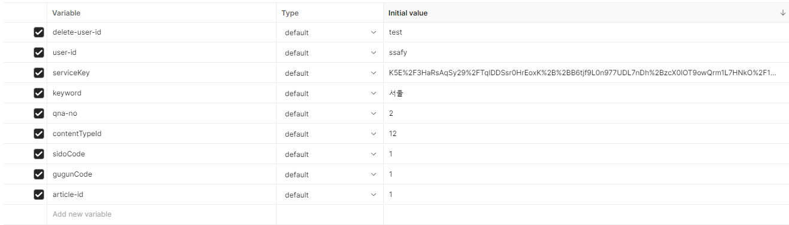

### API 사용시 나오는 postman 화면입니다.

- 사용 api: /user
- method: post

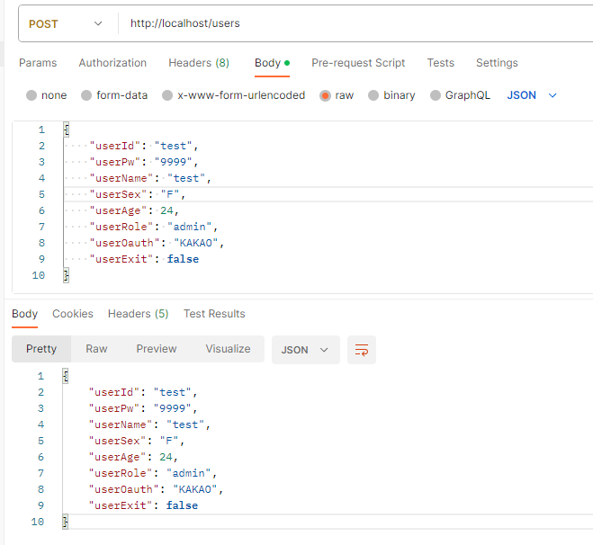

- 사용 api: /users
- method: get

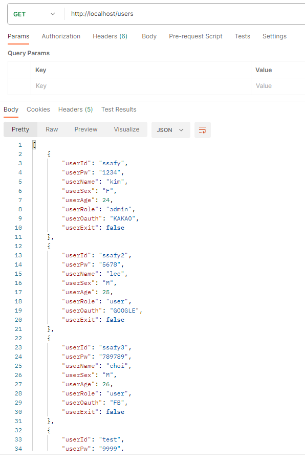

- 사용 api: /users/{{user-id}}
- method: get

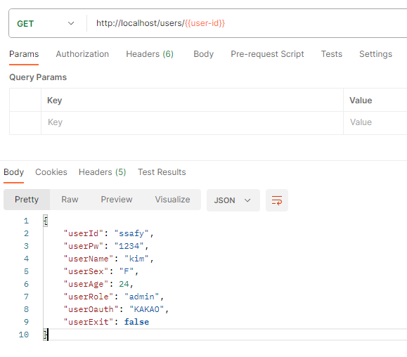

- 사용 api: /users/{{user-id}}
- method: put

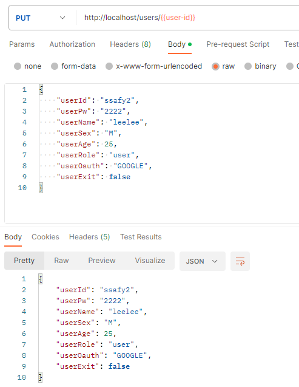

- 사용 api: /users/{{user-id}}
- method: delete

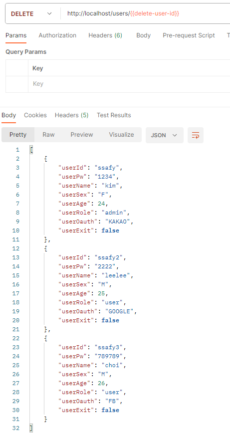

- 사용 api: /users/login
- method: post

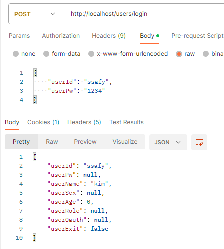

- 사용 api: /users/logout
- method: get

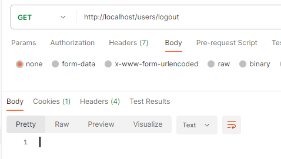

- 사용 api: /qna/qnaList
- method: get

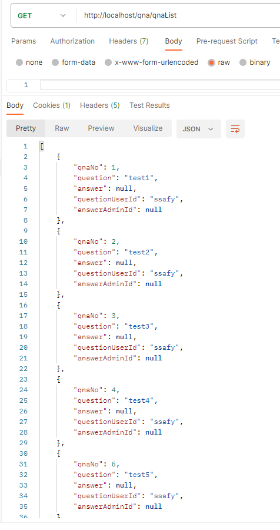

- 사용 api: /qna/question/{{qna-no}}
- method: get

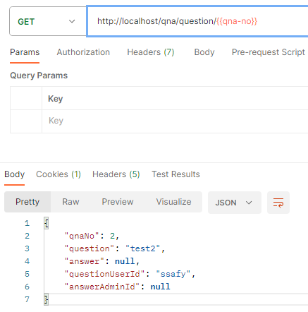

- 사용 api: /qna/question
- method: post

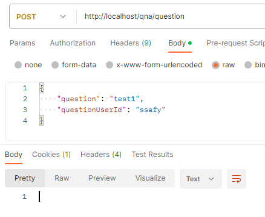

- 사용 api: /qna/question/{{qna-no}}
- method: delete

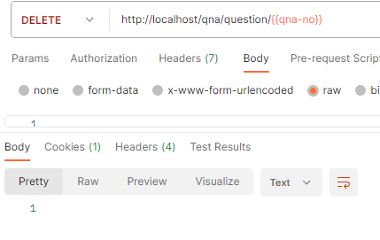

- 사용 api: /qna/answer
- method: put

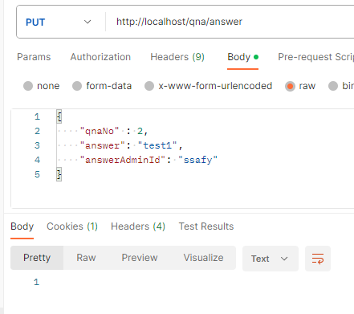

- 사용 api: https://apis.data.go.kr/B551011/KorService1/areaCode1?MobileOS=ETC&MobileApp=SimpleTrip&_type=json&serviceKey={{serviceKey}}
- method: get

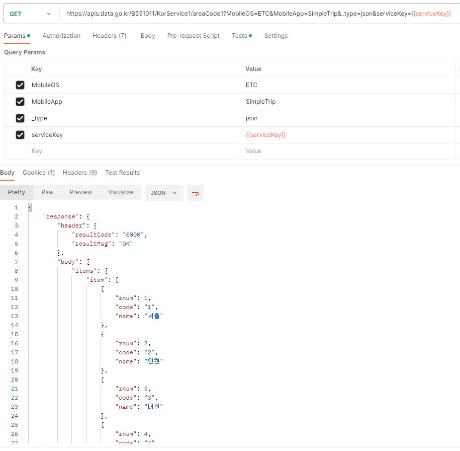

- 사용 api: https://apis.data.go.kr/B551011/KorService1/areaCode1?MobileOS=ETC&MobileApp=SimpleTrip&_type=json&serviceKey={{serviceKey}}&areaCode={{sidoCode}}
- method: get

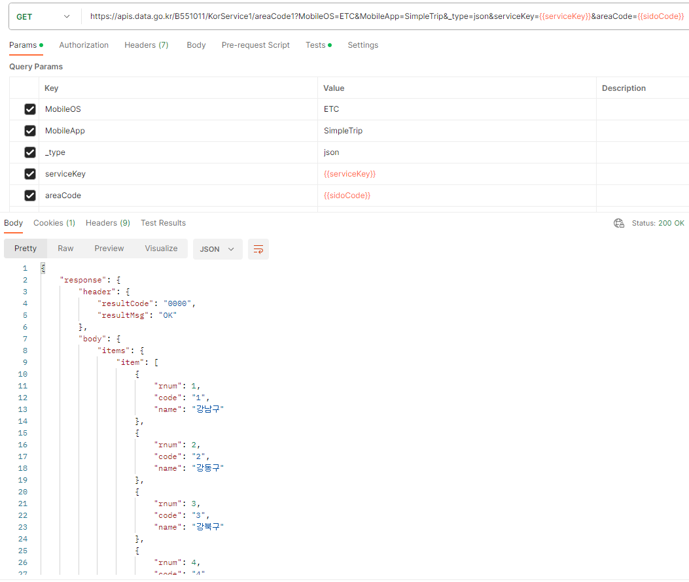

- 사용 api: https://apis.data.go.kr/B551011/KorService1/searchKeyword1?serviceKey={{serviceKey}}&MobileOS=ETC&MobileApp=SimpleTrip&_type=json&areaCode={{sidoCode}}&sigunguCode={{gugunCode}}&contentTypeId={{contentTypeId}}&keyword={{keyword}}
- method: get

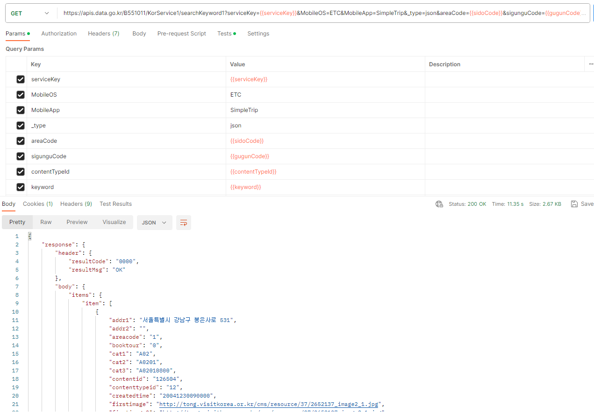

- 사용 api: /articles
- method: post

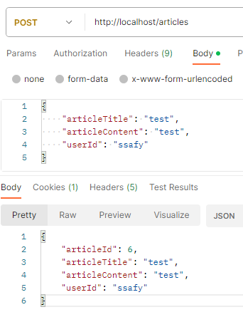

- 사용 api: /articles/{{article-id}}
- method: get

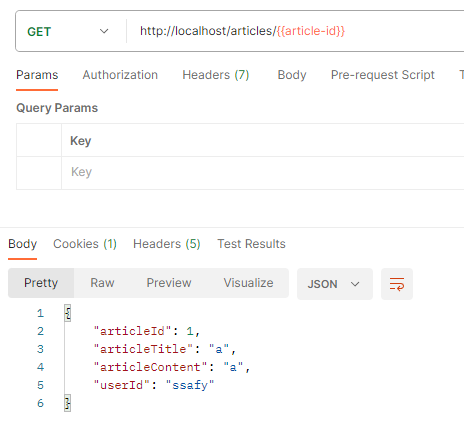

- 사용 api: /articles
- method: get

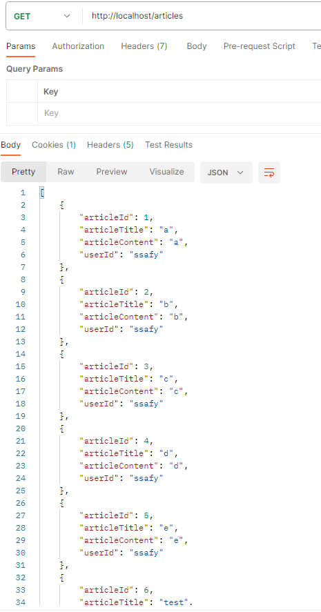

- 사용 api: /articles/{{article-id}}
- method: put

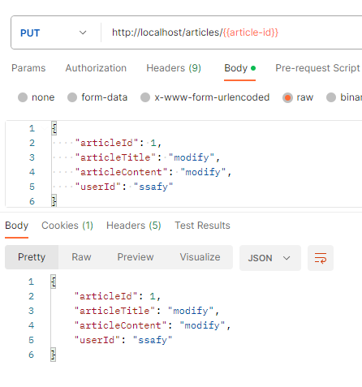

- 사용 api: /articles/{{article-id}}
- method: delete

